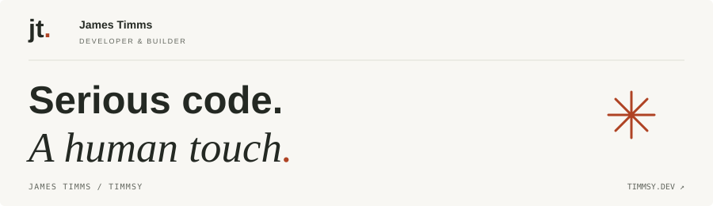
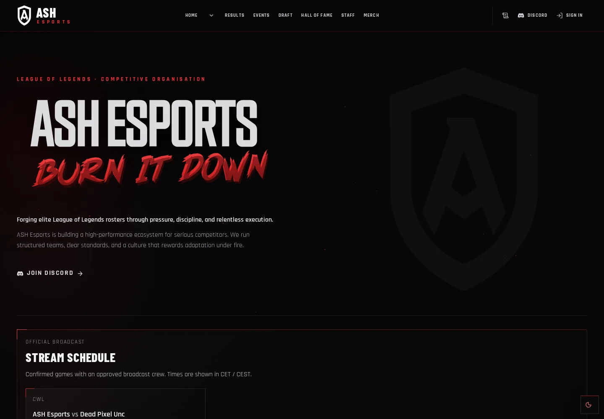

  

# Hey, I’m James.

Most people online know me as **Timmsy**. I’m a full-stack developer in the UK, coding since 2008 and working professionally since 2021.

I like making things that are useful and feel good to use. That might be a Laravel application, a React interface, or a tool for a game I spend too much time playing.

[Portfolio ↗](https://timmsy.dev) · [CV ↗](https://timmsy.dev/cv) · [Email me](mailto:jtimms1998@gmail.com)

 

## Selected work

### [ASH Esports ↗](https://www.ashesports.co.uk)

A platform for an esports organisation: public teams, results, and broadcasts, with recruitment, roster management, and coaching tools behind the scenes. Connects to Discord, Riot Games, and Twitch.

*Next.js · React · TypeScript · Prisma · PostgreSQL*

### [Ultimate League ToolKit ↗](https://github.com/Timmsy1998/Ultimate-League-ToolKit)

A desktop companion for League of Legends. Track ranks and match history, build and import rune pages, and handle everyday tasks through the local client API.

*Electron · React · TypeScript · Vite*

### [Riot Match Analytics ↗](https://github.com/Timmsy1998/riot-match-analytics)

Turns Riot match data into player profiles, match summaries, and performance trends. Built with independently testable analytics and request handling that respects Riot’s API limits.

*Python · FastAPI · HTTPX · Pytest · Docker*

### [PiltoverClient ↗](https://github.com/Timmsy1998/PiltoverClient)

A PHP client for the Riot Games API, usable on its own or in Laravel. Player lookups, profiles, and match histories, with regional routing handled for you.

*PHP · Laravel · Guzzle · PHPUnit · OpenAPI*

### [RiftJS ↗](https://github.com/Timmsy1998/RiftJS)

A TypeScript-first Node.js library for Riot’s APIs. Player profiles, ranked summaries, match timelines, and Data Dragon support, with optional request pacing and paginated match fetching.

*TypeScript · Node.js · Axios · npm*

## A bit about how I work

Most of my day-to-day work is in **Laravel, React, Vue, and TypeScript**. I enjoy untangling a slow query, making a migration less painful, and polishing the small interactions people notice when they use a product.

I care about code the next person can understand. I also like sharing what I learn and leaving a project easier to work on than I found it.

Gaming tools, broadcast overlays, and match data are where a lot of my side projects start. The repositories here are a look at what happens when that curiosity turns into code.

---

Open to frontend and full-stack roles. If you’ve got something interesting in mind, [let’s talk](mailto:jtimms1998@gmail.com).
